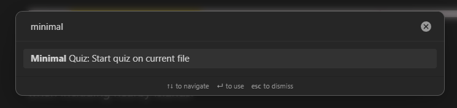
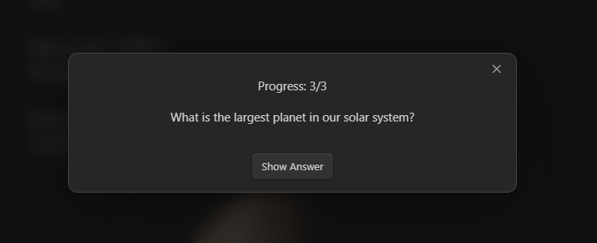
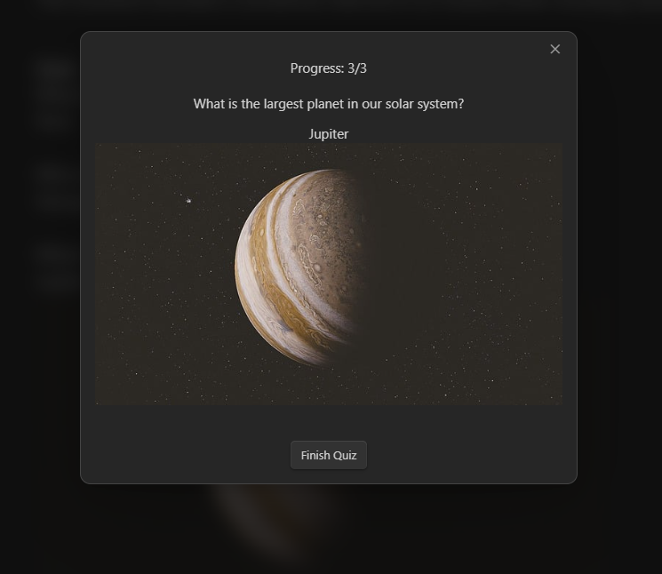

# Obsidian-Minimal-Quiz

Obsidian-MinimalQuiz is the simplest quiz plugin for Obsidian. Define questions directly in your Markdown files—no extra setup required. Just write, quiz, and learn!

## Features
- **Minimalistic**: No complex UI, just Markdown-based quizzes.
- **Intuitive Syntax**: Questions end with `?`, followed by the answer on the next line.
- **Seamless Integration**: Works directly within Obsidian notes.

## How It Works
Write your quiz questions in a Markdown file like this:

```
What is the capital of France?
Paris

Who wrote "1984"?
George Orwell

What is the largest planet in our solar system?
Jupiter
```
## ▶️ Example in Action
### In file


### Press icon or execute command


### Quiz in action



The plugin will automatically detect the questions and present them in quiz format.

## Shoutout
This project was inspired by [Obsidian Simple Note Quiz](https://github.com/beginner137/Obsidian-simple-note-quiz). While that plugin offers great functionality, Obsidian-MinimalQuiz aims to provide an even more minimalistic design with improved stability and no bugs.

## Installation
1. Download and extract the latest release into your Obsidian plugins folder.
2. Enable **Minimal Quiz** in the Obsidian settings.

## License
This project is licensed under the MIT License.
